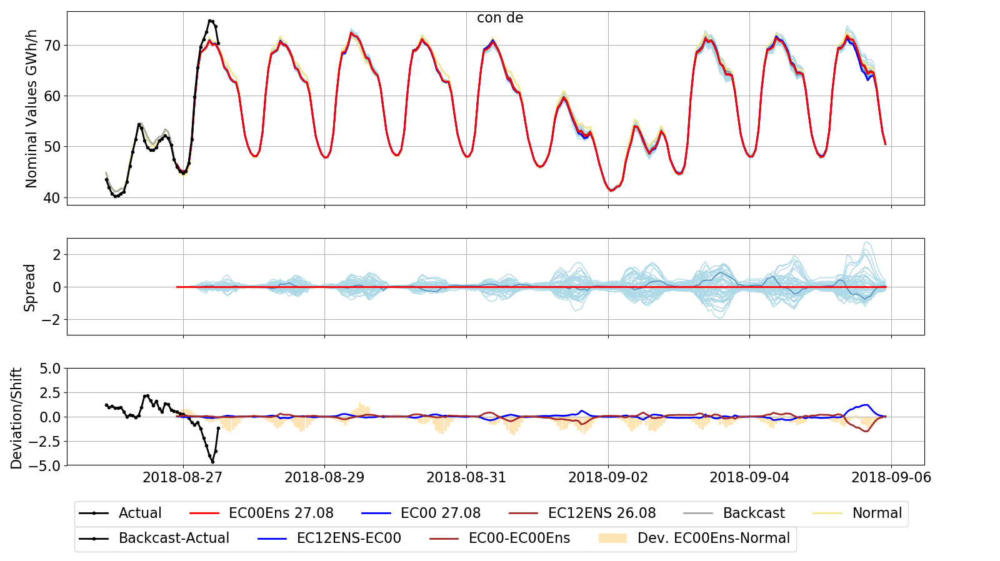

.. _examples:

Examples
========

TIME_SERIES curve examples
---------------------------

* Simple example how to read a TIME_SERIES curve 
  (`[view on github] <https://github.com/wattsight/wapi-python/blob/master/examples/Timeseries_curve_examples/ts_simple_read.py>`_ , 
  :download:`[download] <../examples/Timeseries_curve_examples/ts_simple_read.py>`)
* Aggregation example
  (`[view on github] <https://github.com/wattsight/wapi-python/blob/master/examples/Timeseries_curve_examples/ts_aggregation.py>`_ , 
  :download:`[download] <../examples/Timeseries_curve_examples/ts_aggregation.py>`)
* Aggregation example - changing timezones
  (`[view on github] <https://github.com/wattsight/wapi-python/blob/master/examples/Timeseries_curve_examples/ts_aggregation_timezone.py>`_ , 
  :download:`[download] <../examples/Timeseries_curve_examples/ts_aggregation_timezone.py>`)
* Filter example
  (`[view on github] <https://github.com/wattsight/wapi-python/blob/master/examples/Timeseries_curve_examples/ts_filter.py>`_ , 
  :download:`[download] <../examples/Timeseries_curve_examples/ts_filter.py>`)
* Read multiple curves and save them as csv
  (`[view on github] <https://github.com/wattsight/wapi-python/blob/master/examples/Timeseries_curve_examples/ts_get_multiple_curves.py>`_ , 
  :download:`[download] <../examples/Timeseries_curve_examples/ts_get_multiple_curves.py>`)

TAGGED curve examples
----------------------

* Simple example how to read a TAGGED curve
  (`[view on github] <https://github.com/wattsight/wapi-python/blob/master/examples/Tagged_curve_examples/tag_simple_read.py>`_ , 
  :download:`[download] <../examples/Tagged_curve_examples/tag_simple_read.py>`)
* multiple tags example

INSTANCE curve examples
-------------------------

* Simple example how to read an INSTANCE curve
  (`[view on github] <https://github.com/wattsight/wapi-python/blob/master/examples/Instance_curve_examples/ins_simple_read.py>`_ , 
  :download:`[download] <../examples/Instance_curve_examples/ins_simple_read.py>`)
* Get multiple instances
* Get latest instance
* Get multiple instance curves and save them as csv
  (`[view on github] <https://github.com/wattsight/wapi-python/blob/master/examples/Instance_curve_examples/ins_get_multiple_curves.py>`_ , 
  :download:`[download] <../examples/Instance_curve_examples/ins_get_multiple_curves.py>`)

TAGGED_INSTANCE curve examples
--------------------------------

* Simple example how to read a TAGGED_INSTANCE curve
  (`[view on github] <https://github.com/wattsight/wapi-python/blob/master/examples/Tagged-Instance_curve_examples/tagins_simple_read.py>`_ , 
  :download:`[download] <../examples/Tagged-Instance_curve_examples/tagins_simple_read.py>`)
* Get available tags
* Read data for multiple tags
* Get multiple instances
* Get latest instance

Events example
--------------

* tbd

General examples
-----------------

* Aggregation examples using pandas (TBD)
* Combining Series to DataFrame in pandas
* Comparing temperature forecast and actuals

Reproduce figures from wattsight.com
-------------------------------------

* Reproduce the 4 following Fundamental figures for any region
  (`[view on github] <https://github.com/wattsight/wapi-python/blob/master/examples/Tagged-Instance_curve_examples/tagins_simple_read.py>`_ , 
  :download:`[download] <../examples/Tagged-Instance_curve_examples/tagins_simple_read.py>`)

   
   `Consumption <https://app.wattsight.com/#tab/power/115/2>`_
  
  * `Consumption <https://app.wattsight.com/#tab/power/115/2>`_
    
    .. figure:: img/con_de.png
       :width: 60%
       :align: center
       
  * `Photovoltaic <https://app.wattsight.com/#tab/power/135/2>`_
  * `Wind <https://app.wattsight.com/#tab/power/126/2>`_
  * `Residual Load <https://app.wattsight.com/#tab/power/109/2>`_

* https://app.wattsight.com/#tab/power/245/2
* https://app.wattsight.com/#tab/power/255/2
* https://app.wattsight.com/#tab/power/131/2
* https://app.wattsight.com/#tab/power/1015/3
* https://app.wattsight.com/#tab/power/847/3
* https://app.wattsight.com/#tab/power/167/43