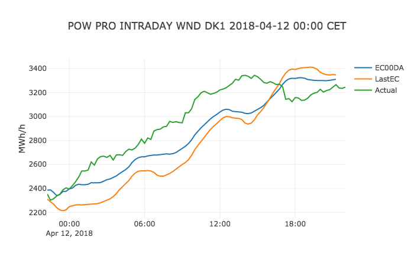
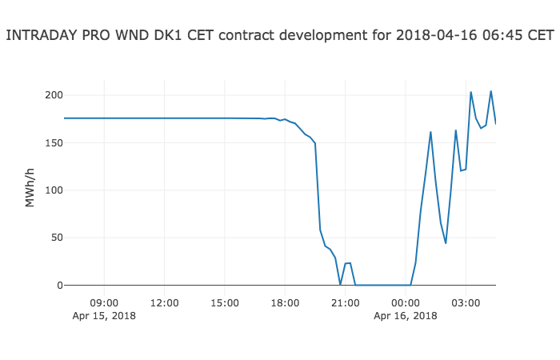
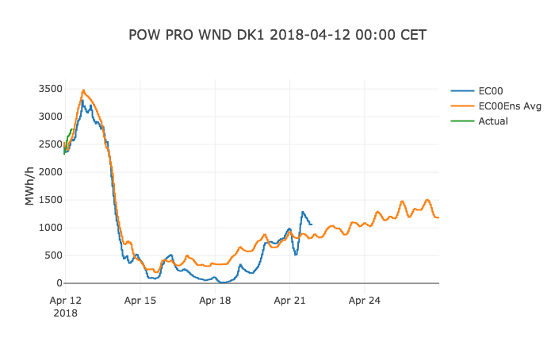

# Wattsight API python library usage example
An introductory example of using Wattsight API python library for searching, fetching, and plotting Wattsight data series. A number of use cases is presented in order to introduce different data structures.

## Dependencies

[Wattsight API python library](https://github.com/wattsight/wapi-python/)   
[Jupyter (iPython) Notebooks](http://jupyter.org/)   
[Pandas Data Analysis library](http://pandas.pydata.org/)   
[Plotly Charting library](https://plot.ly/)   
[World Timezone Definitions for Python](http://pytz.sourceforge.net/)   

## Installation of Wattsight API python library

1. Using curl

	```command
	curl -LOk https://github.com/wattsight/wapi-python/archive/wapi-python-0.0.7.zip
	unzip wapi-python-0.0.7.zip
	cd wapi-python-wapi-python-0.0.7
	python setup.py install
	```

2. Using pip

	```command
	pip install git+https://github.com/wattsight/wapi-python@wapi-python-0.0.7
	```

## Implementation
Complete working code can be found in the attached Jupyter Notebook file.

1. Established a session using client cridentials. 

	This requires having an OAuth client, which can be created at https://auth.wattsight.com/account/oauth-clients.

	```python
	>>> session = wapi.Session(client_id='client id', client_secret='client secret')
	```

2. Search curves by meta data.

	For this use case define meta criteria for DK1 area wind power production.

	```python
	>>> meta_criteria = {'commodity': 'POW',
	                     'category': ['WND', 'Intraday'], 
	                     'unit': 'MWH/H',
	                     'area': 'DK1', 
	                     'data_type': ['A', 'F']}
	>>> curves = session.search(**meta_criteria)
	['pro dk1 wnd intraday ec00da mwh/h cet min15 f',
	 'pro dk1 wnd intraday lastec mwh/h cet min15 f',
	 'pro dk1 wnd intraday tso mwh/h cet min15 f',
	 'pro dk1 wnd intraday mwh/h cet min15 a',
	 'pro dk1 wnd ec00 mwh/h cet min15 f',
	 'pro dk1 wnd ec12 mwh/h cet min15 f',
	 'pro dk1 wnd gfs00 mwh/h cet min15 f',
	 'pro dk1 wnd gfs06 mwh/h cet min15 f',
	 'pro dk1 wnd gfs12 mwh/h cet min15 f',
	 'pro dk1 wnd gfs18 mwh/h cet min15 f',
	 'pro dk1 wnd ec00ens mwh/h cet min15 f',
	 'pro dk1 wnd ec12ens mwh/h cet min15 f',
	 'pro dk1 wnd mwh/h cet min15 a']
	```

3. For the first example, filter on intraday curves and retrieve data for the selected curves.

	```python
	>>> intraday_curves = [c for c in curves if 'INTRADAY' in c.categories]
	>>> data = {}
	>>> label = {}
	>>> issue_date = pytz.timezone('CET').localize(
						datetime.strptime('2018-04-12 00:00', "%Y-%m-%d %H:%M"))
	>>> date_from = issue_date + timedelta(minutes=15)
	>>> date_to = date_from + timedelta(hours=24)
	>>> for c in intraday_curves:
	>>>     if c.curve_type == 'INSTANCES':
	>>>         ts = c.get_instance(issue_date)
	>>>         if ts is not None:
	>>>             label[c.name] = ';'.join(c.sources)
	>>>             data[c.name] = ts.to_pandas()
	>>>     elif c.curve_type == 'TIME_SERIES':
	>>>         data[c.name] = c.get_data(data_from=date_from, 
	>>>                                   data_to=date_to).to_pandas()
	>>>         label[c.name] = 'Actual'
	```

4.  Plot selected data

	```python
	>>> fig = tls.make_subplots(len(data), cols=1, shared_xaxes=True)
	>>> for key in data.keys():
	>>>     ts = data[key]
	>>>     fig.append_trace({'x': ts.index, 'y': ts.values, 'type': 'scatter', 
	>>>                       'name': label[key]}, 1, 1)
	>>> title = ' '.join([c.commodity,
	>>>                   ' '.join(c.categories),
	>>>                   c.area,
	>>>                   issue_date.strftime("%Y-%m-%d %H:%M"),
	>>>                   c.time_zone])
	>>> fig['layout'].update(title=title)
	>>> fig['layout'].update(yaxis=dict(title=c.unit))    
	>>> offline.iplot(fig)
	```

	

5.  Retrive data for more instances and build contract development series.

	```python
	>>> curve = intraday_curves[0]
	>>> latest_instance = curve.get_latest(with_data=False)
	>>> issue_date_str = latest_instance.issue_date
	>>> issue_date = latest_instance.tz.localize(
						datetime.strptime(latest_instance.issue_date, 
 	                                      "%Y-%m-%dT%H:%M:%SZ"))
	>>> value_date = issue_date + timedelta(minutes=15)
	>>> index = []
	>>> values = []
	>>> forecast_exists = True
	>>> while forecast_exists:
	>>>     ts = curve.get_instance(issue_date=issue_date)
	>>>     try:
	>>>         ts = curve.get_instance(issue_date=issue_date).to_pandas()
	>>>         values.append(ts[value_date])
	>>>         index.append(issue_date)
	>>>         issue_date = issue_date - timedelta(minutes=15)
	>>>     except:
	>>>         forecast_exists = False
	```

	

6. For an example of working with tagged data, filter out weather data forecast curves.

	```python
	>>> curves_at00 = [c for c in curves 
					   if 'INTRADAY' not in c.categories 
						and (c.data_type == 'A' or c.sources [0] in ["EC00", "EC00Ens", 'GFS00'] )
					   ]
	>>> [c.name for c in curves_at00]
    ['pro dk1 wnd ec00 mwh/h cet min15 f',
	 'pro dk1 wnd gfs00 mwh/h cet min15 f',
	 'pro dk1 wnd ec00ens mwh/h cet min15 f',
	 'pro dk1 wnd mwh/h cet min15 a']
	```

7.  Retrive data for the selcted curves.

	```python
	>>> data = {}
	>>> label = {}
	>>> issue_date = pytz.timezone('CET').localize(
						datetime.strptime('2018-04-12 00:00', "%Y-%m-%d %H:%M"))
	>>> date_to = date_from + timedelta(days=14)
	>>> for c in curves_at00:
	>>>     ts = None
	>>>     if c.curve_type == 'TAGGED_INSTANCES':
	>>>         ts = c.get_instance(issue_date=issue_date, tag='Avg')
	>>>         label[c.name] = ' '.join([';'.join(c.sources), 'Avg'])
	>>>     elif c.curve_type == 'INSTANCES':
	>>>         ts = c.get_instance(issue_date=issue_date)
	>>>         label[c.name] = ';'.join(c.sources)
	>>>     elif c.curve_type == 'TIME_SERIES':
	>>>         data[c.name] = c.get_data(data_from=date_from, data_to=date_to).to_pandas()
	>>>         label[c.name] = 'Actual'
	>>>     if ts is not None:
	>>>         data[c.name] = ts.to_pandas()
	```

	
